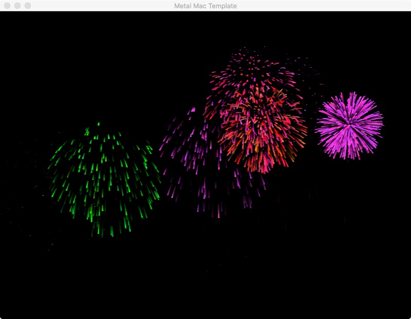

= Fireworks Metal Demo

== Overview

This is a simple (500 lines of code) graphics demo that shows animated
fireworks.   I wrote it for two reasons: to see what Swift can do, and for
something new and fun (I never do 3D graphics in my day job).

This uses the "Metal" low-level 3D graphics API.  Mac OSX 10.11+ is required.

Features

- 60 FPS even with 80,000 points (2015 Mac Book)
- Silky smooth "global time" rendering; no step-based ticks with floating point errors.  
- Gravity: standard formula, secs ^ 2
- Air drag: logarithmic.  Assumes angle doesn't change.
- Per-particle fade time.  Linear fadeout, but opacity > 1 makes it logarithmic
- Per-particle trail length.  Draws overlapping triangles
- Per-particle Color / Alpha Randomization
- Alpha blending

NOTE: Make sure to run it in release mode for lowest CPU use (edit the
scheme).

Video: link:https://youtu.be/a7Brq0Qowxw[Watch On Youtube]

(c) 2015 Karl Pickett
